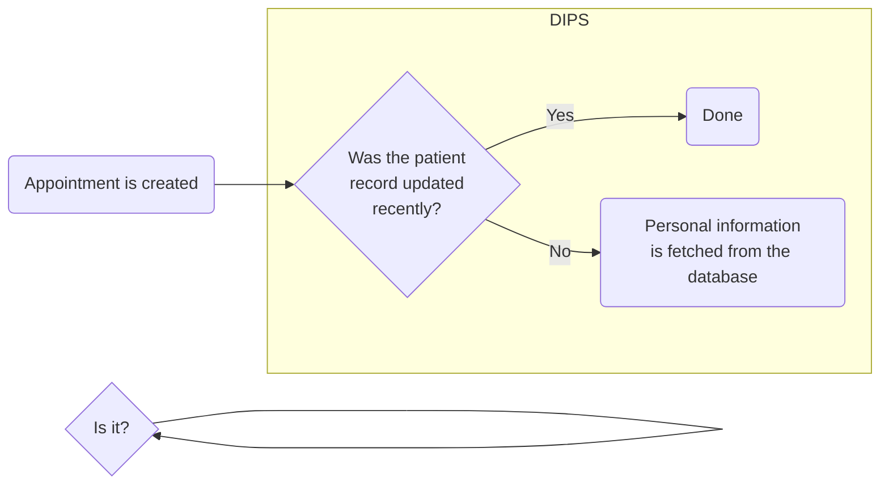

```mermaid
  graph LR;
      create_appoint(Appointment is created)-->when_updated{Was the patient\nrecord updated\nrecently?};
      subgraph DIPS
        when_updated -- Yes --> done(Done)
        when_updated -- No --> fetch_info(Personal information\nis fetched from the database)
      end
      
      B-->B{Is it?};
```

