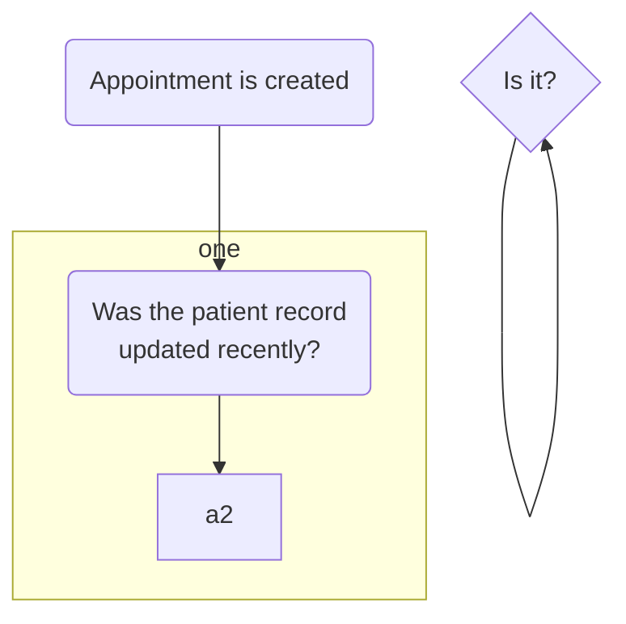

```mermaid
  graph TD;
      create_appoint(Appointment is created)-->when_updated(Was the patient record\nupdated recently?);
      subgraph one
        when_updated-->a2
      end
      B-->B{Is it?};
```

