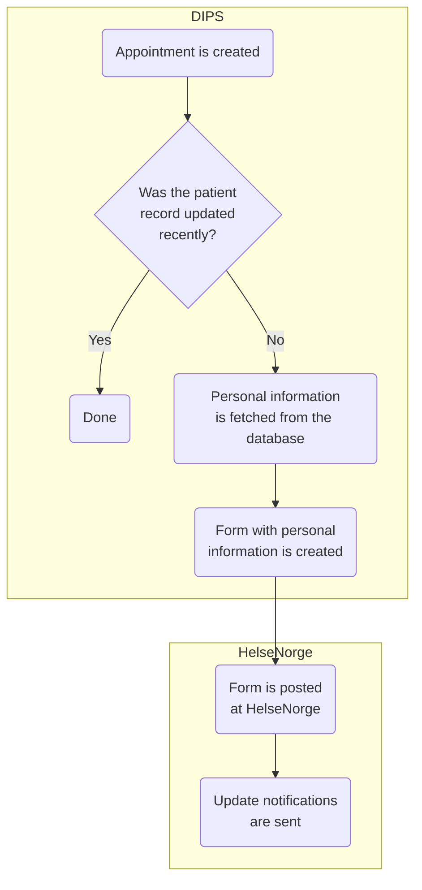
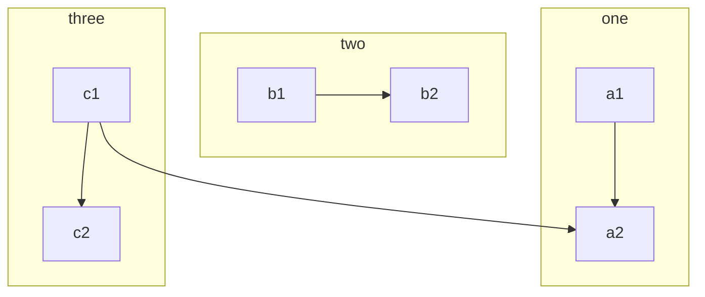

```mermaid
  flowchart TB;
      subgraph DIPS
        direction LR;
        create_appoint(Appointment is created)-->when_updated{Was the patient\nrecord updated\nrecently?};
        when_updated -- Yes --> done(Done);
        when_updated -- No --> fetch_info(Personal information\nis fetched from the database);
        fetch_info --> create_form(Form with personal\ninformation is created);
      end
      subgraph HelseNorge
        direction LR;
        create_form --> post_form(Form is posted\nat HelseNorge);
        post_form --> notify(Update notifications\nare sent);
        
      end
```

```mermaid
flowchart TB
    c1-->a2
    subgraph one
    a1-->a2
    end
    subgraph two
    b1-->b2
    end
    subgraph three
    c1-->c2
    end
```
