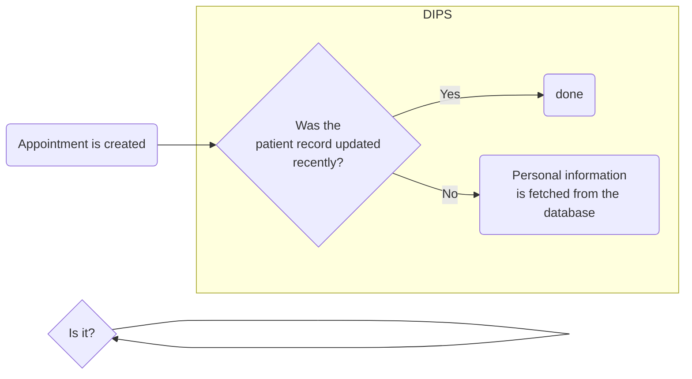

```mermaid
  graph LR;
      create_appoint(Appointment is created)-->when_updated{Was the\npatient record updated\nrecently?};
      subgraph DIPS
        when_updated -- Yes --> done
        when_updated -- No --> fetch_info(Personal information\nis fetched from the database)
      end
      done(done)
      B-->B{Is it?};
```

