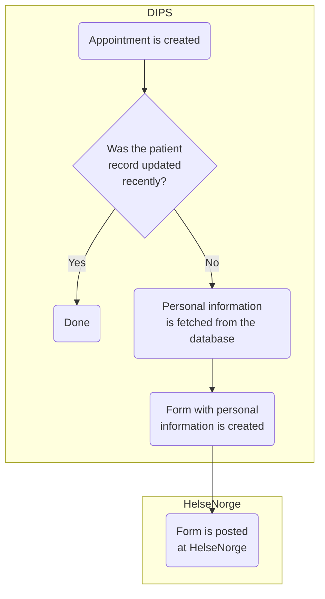

```mermaid
  graph TB;
      subgraph DIPS
        create_appoint(Appointment is created)-->when_updated{Was the patient\nrecord updated\nrecently?};
        when_updated -- Yes --> done(Done);
        when_updated -- No --> fetch_info(Personal information\nis fetched from the database);
        fetch_info --> create_form(Form with personal\ninformation is created);
      end
      subgraph HelseNorge
        create_form --> post_form(Form is posted\nat HelseNorge)
      end
```

