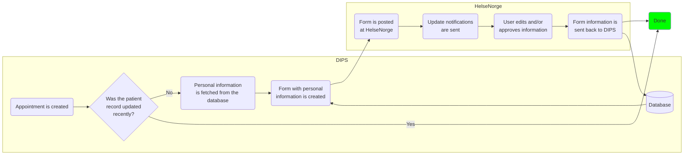

```mermaid
  flowchart LR
      
      done(Done)
      style done fill:#00ff00
      
      subgraph DIPS
        direction LR
        create_appoint(Appointment is created)-->when_updated{Was the patient\nrecord updated\nrecently?}
        when_updated -- No --> fetch_info(Personal information\nis fetched from the database)
        fetch_info --> create_form(Form with personal\ninformation is created)
        db[(Database)] --> create_form
      end
      
      subgraph HelseNorge
        direction LR
        post_form(Form is posted\nat HelseNorge) --> notify(Update notifications\nare sent)
        notify --> edit(User edits and/or\napproves information)
        edit --> send_back(Form information is\nsent back to DIPS)
        
      end
      
      when_updated -- Yes --> done
      create_form --> post_form
      send_back --> done
      send_back --> db
      
```
